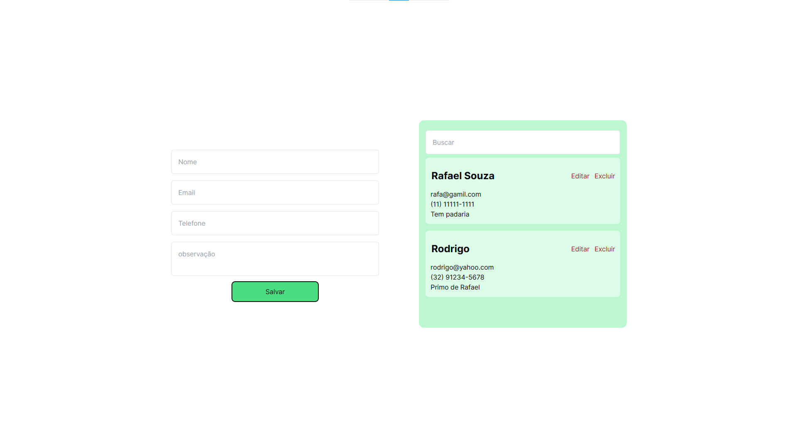

# Simple CRUD using NextJS and firebase

## Agenda

This simple project is an agenda. It has 4 fields for the following data: name, phone number, email, and note. It uses Firebase for the database.

It has the CRUD operations:
* C for Create. By inputting values into the fields, you can create the data, and it will be saved in your Firebase.
* R for Read. It displays all the contacts you have in your agenda. There is also an input to search contacts according to the search value.
* U for Update. Each contact has an update button to change its value.
* D for Delete. Also, each contact has a delete button to remove the contact.

### Firebase
To create a database on Firebase, you need to do the following:
* Go to https://firebase.google.com/ and login.
* Click in button **Go to console**
* Click on Add new Project
* Give a name to your database
* Continue and click in Create Project
* Starting selecting your app as Web
* Register your app
* After that will appear your configuration. There is a file called *firebase example.ts*. Use it as a template, put your configuration and change its name to *firebase.ts*
* On the projct page, click on **Realtime Database**
* Then click on Create database
* The location you can let the one that firebase will suggest and click Next
* For security, select Initiate on **test mode** and activate it.
* DONE. Now all your contacts that you will save, will appear on your database.

### Details

For this project, I followed a tutorial. [Click here](https://youtube.com/playlist?list=PLIeTPQT6t1tnaviY16Wr_6C0rqteEkUQg&si=K06FpZ6AQffe7BDT) to see the tutorial.

Two hooks was used on this project. useState and useEffect.
useState was used to retrieve data from the inputs and also to control the state of the app. The contacts shown on the left will depend on certain conditions. 
If the search input is empty, all contacts will be shown. Otherwise, the search results will appear.

One thing I did differently was the modal. To edit, I used a modal that I created to update the contact, instead of using the form from the home page, as shown in the tutorial.

For styles he used SASS. I used Tailwind.

## Thank you 

Any tips are welcome. 😁